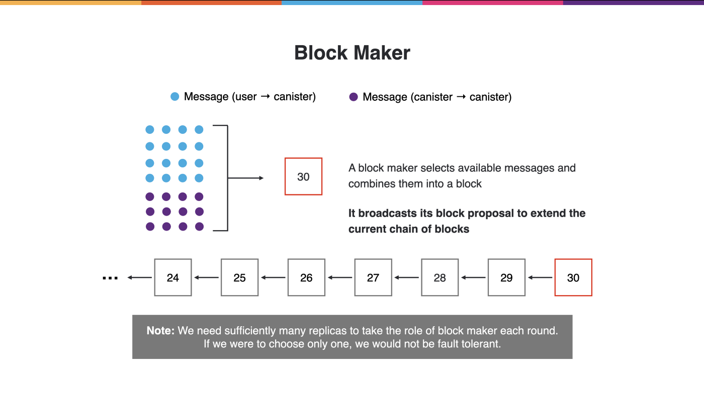
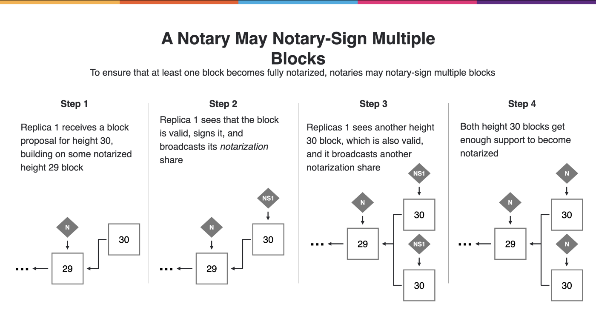
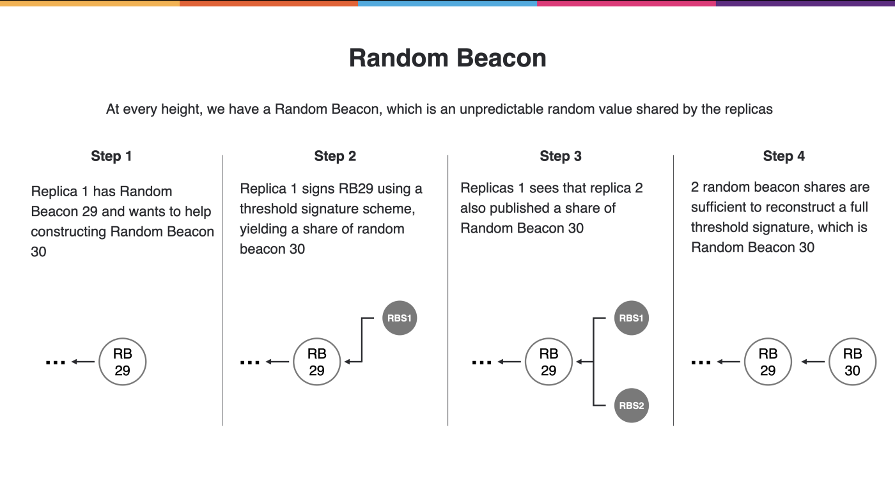
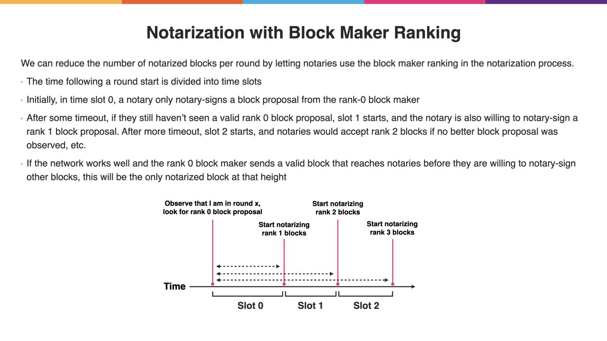
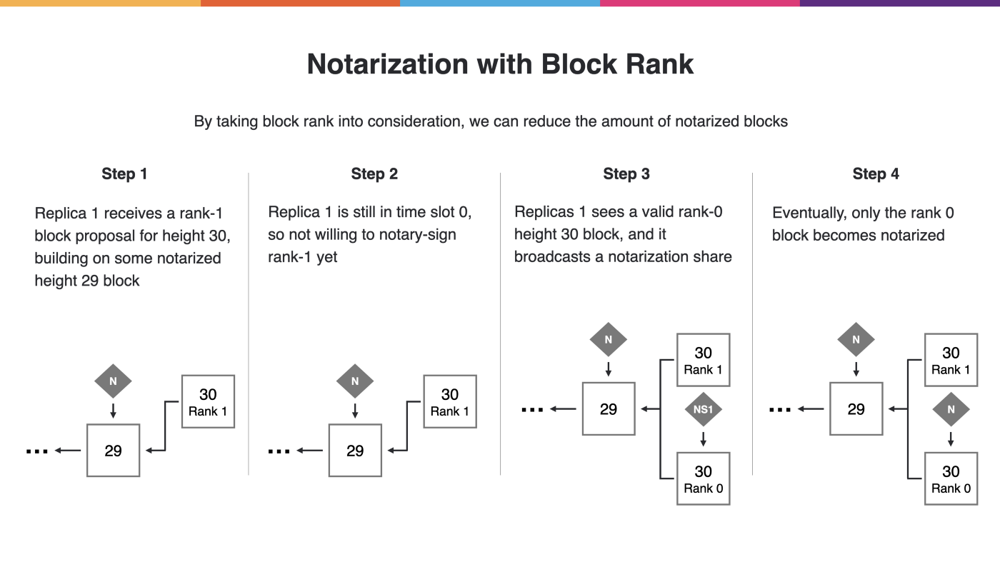
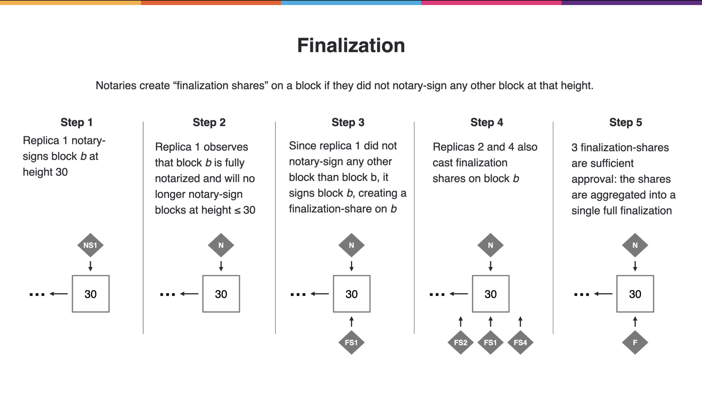

# 1. Termilogy:

- Consensus on subnet
- Messages -> transactions
- Replica -> block producer / block validator

# 2. Building blocks:
N is total replicate in a subnet

f is faulty replica

- N = 3f + 1 OR f < N / 3-> Byzantine Fault Tolerance
- BLS (t,n)-threshold signature scheme (TSS) - (N-f, N)
- Random oracles and BLS schema aggeration creating random beacon, which contain ranking of shares
- 4 components
    +   Block Making - random sealing
    +   Notarization - block production alternative based on ranking
    +   Random Beacon - agree on randomness (randomness is nondeterminitic)
    +   Finalization - asynchrous process, when a sub-chain is finalized (logic gate operations)

# 3. Components
Notarization share is the share in the aggerated signature of BLS (full notarization)
Size of aggerated signature is small

- Block Making
    +   Replica combines message and sign, then broadcasts block proposal (include its notarization share)
     
    +   Any replica might take part of producing the blocks

notary-sign is sign a share of notarization share

- Notarization 
    +   Any replica might notary-sign any block proposal at THE SAME height and broadcasts it (boardcast notarization share)
    
    +   An block B is considered as notarized when it's sealed by N-f notarization share out of N notarization shares (N-f, N)
    ! [image info](notarization.png)
    +   The above statement cause there's a tree contains multiple branches of notarized blocks
    
- Random Beacon
    +   At a height H, a replica has Random Beacon RB-H. For H+1 block, it's using threshold signature to yield a share in Random Beacon Share RBS-H+1. This replica broadcast its RBS-H+1 
    
    +   Random Beacon RB-H+1 constructed with threshold (N-f, N) -> common randomness - Random Beacon RB-H+1
    +   Using common RB-H+1, etc... Constructed a rank among replica, which is prioritized in producing blocks.
    +   Using timeslot-based to wait (synchronous) for the highest rank replica to produce, if this replica doesn't produce, move to the next rank replica. If highest rank replica signed a block, that block is considered as "most reliable block". No need more notary-sign and broadcast.
    
    
    +   The above statments still leaves the problem of: a replicate doesn't know, is it on the "most reliable block" height.

finality-sign is sign a share of finalization share

- Finalization:
    +   Asynchorous with other components
    +   A replica finality-sign and boardcast a finalization-share on block B at height H, which means that it's no longer notary-sign any block B' with H' =< H.
    
    +   A full finalization constructed with threshold (N-f, N)
    +   Finalization proof is a logical proof states "on heigh H block B, that no other notarized block B' at height H exists)
        1. Replicas are Byzantine Fault Tolerance, f < N / 3, N is total replicate in a subnet, f is faulty replica.
        2. A full finalization on b requires N-f replicas to finality-sign (by TSS)
        3. At least N-2f of the N-f replicas that finality-signed b must be honest (by assumption that =< f replicas are corrupt)
        4. An honest replica that finality-signed B did not notary-sign any height H block other than B (by TSS)
        5. At least N-2f replicas did not notary-sign any height H block other than B (by 2 and 3)
        6. A full notarization requires N-f notarization-shares (by TSS)
        7. The N-(N-2f) < N-f remaning replicas that may have notary-signed height H block B' are not sufficent to reach the notarization threshold of N-f (by 4 and 5)
